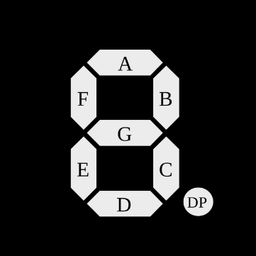

# Moncky 1 processor emulator

The Moncky 1 is a simple RISC (Reduced Instruction Set) 16 bit processor. My goal is to be able to run Moncky 1 machine code on the Arduino by  emulating the Moncky 1 processor.

## **Phase 1: Representing the CPU and memory**

The state of the CPU is stored in a **struct**, this contains **all flags** and **registers**.  
**FLAGS: carry, zero, sign, overflow** (Always shown by the LEDs)  
**REGISTERS: 16x  16 bit registers (R0 \-\> R15)**  
**PROGRAM COUNTER:** points to the currently executed instruction in the program memory (NOT DIRECTLY ACCESSIBLE)

The dataram is an array of 16 bit integers that is dynamically allocated, (or a struct with “blocks” of memory that are dynamically allocated).

The program memory is static, and can therefore be stored by an array of 16 bit integers.  
(The program can be defined in **“program.h”** otherwise a default program is defined and executed).

**BUTTON1 interrupt**: display values of all the registers (R0 to R15).

## **Phase 2: Implementing the instruction set**

Implement a function that simulates a single processor/clock cycle using the current state of the processor (executing the current  instruction at the program counter).

### INSTRUCTION SET

| machine language | assembly | meaning | example |
| :---- | :---- | :---- | :---- |
| 0000 xxxx xxxx xxxx | halt | the processor stops | halt |
| 00x1 iiii iiii rrrr | li r, i | reg\[r\] \= i | li r3, 42 |
| 01xx AAAA rrrr ssss | ALU r, s | reg\[r\] \= reg\[r\] ALU reg\[s\] | add r3, r4 |
| 100x xxxx rrrr ssss | ld r, (s) | reg\[r\] \= DATARAM\[reg\[s\]\] | ld r2, (r15) |
| 101x xxxx rrrr ssss | st r, (s) | DATARAM\[reg\[s\]\] \= reg\[r\] | st r1, (r15) |
| 110x xxxx xxxx rrrr | jp r | PC \= reg\[r\] | add r3, r4 |
| 1111 xxxx xccc rrrr | jpc r | if(c) then PC \= reg\[r\] | jpz r1 |

**iiii iiii** 8 bit number immediate  
**rrrr** register nr 0-15  
**ssss** register nr 0-15

#### ALU INSTRUCTIONS

| AAAA | assembly | meaning |
| :---- | :---- | :---- |
| 0000 | NOP | No operation: the result is equal to the second input of the ALU |
| 0001 | OR | bitwise OR |
| 0010 | AND | bitwise AND |
| 0011 | XOR | bitwise XOR |
| 0100 | ADD | addition |
| 0101 | SUB | subtraction |
| 0110 | SHL | shift the first number left by the second number |
| 0111 | SHR | shift the first number right by the second number |
| 1000 | ASHR | SHR but maintain sign bit |
| 1001 | NOT | logic inverse: the result is the 1-complement of the second input |
| 1010 | NEG | negative: the result is the 2-complement of the second input |

#### CONDITIONS (FLAGS)

| ccc | flag | meaning |
| :---- | :---- | :---- |
| 000 | c | if the carry flag is equal to 1 (the calculation resulted in 1 extra bit being discarded) |
| 001 | nc | if the carry flag is equal to 0 (the calculation did not result in an extra bit) |
| 010 | z | if the zero flag is equal to 1 (the result of the calculation was 0\) |
| 011 | nz | if the zero flag is equal to 0 (the result of the calculation was not equal to 0\) |
| 100 | s | if the sign flag is equal to 1 (the result of the calculation was negative) |
| 101 | ns | if the sign flag is equal to 0 (the result of the calculation was not negative) |
| 110 | o | if the overflow flag is equal to 1 (the calculation resulted in an overflow) |
| 111 | no | if the overflow flag is equal to 0 (the calculation did not result in an overflow) |

**BUTTON3 Interrupt:** Execute a single instruction / clock cycle by calling the function implemented above

## **Phase 3: Implementing the processor clock using a Timer**

To make the processor run on its own, we must perform clock cycles automatically, to do this we will use a Timer. The goal is to be able to adjust the clock speed using the **Potentiometer.** And to be able to stop/pause the automatic clock using the **BUTTON2 interrupt.**

## **Phase 4: Map R14 and R15 to the display**

R14 and R15  is connected to 4x 8-segment displays (7seg \+ dot)

Each 8 bits correspond to one display, the bit order is:

| R14 |  | R15 |  |
| :---: | :---: | :---: | :---: |
| DISPLAY1 | DISPLAY2 | DISPLAY3 | DISPLAY4 |
| PCDE GFAB | PCDE GFAB | PCDE GFAB | PCDE GFAB |

(P is the **dot or DP**)  

## **Extra: Map buzzer to a register or make it signal halt or overflow**
